# Fabric IQ Lab - Step-by-Step Guide

This guide is adapted from `Fabric IQ Lab.docx` and includes the screenshots extracted from the source document in-line with the lab steps.

## Table of contents

- [Exercise 01: Create a workspace for Fabric IQ](#exercise-01-create-a-workspace-for-fabric-iq)
- [Exercise 02: Generate ontology data](#exercise-02-generate-ontology-data)
- [Exercise 03: Create ontology](#exercise-03-create-ontology)
- [Exercise 04: Create a data agent with Ontology](#exercise-04-create-a-data-agent-with-ontology)
- [Exercise 05: Create an operations agent](#exercise-05-create-an-operations-agent)

## L300: Building intelligent solutions with Microsoft Fabric IQ - Hands-on lab

This lab introduces you to building a data and analytics foundation using Microsoft **Fabric** to support **Fabric** IQ capabilities. You'll begin by creating a dedicated workspace configured with appropriate capacity, governance, and access controls. From there, you'll establish a unified data platform by creating a **Lakehouse** for structured data and an **Eventhouse** for real-time streaming data. The lab then guides you through ingesting and processing data using notebooks, enabling both batch and streaming analytics. Finally, you'll generate an ontology that defines business entities, relationships, and semantics, creating a business-friendly data layer that supports AI-driven insights and intelligent data agents. By the end of this lab, you'll have a fully integrated environment that combines data engineering, real-time analytics, and semantic modeling to power advanced analytics scenarios.

### Exercises

- **Create** and configure a Microsoft **Fabric** workspace
- Build a **Lakehouse** for structured data storage
- Build an **Eventhouse** for real-time data ingestion and analytics
- **Upload** and process ontology package files
- **Import** and execute notebooks to load data into **Fabric** services
- Validate data in **Lakehouse** and **Eventhouse** environments
- Generate an ontology from packaged data
- Explore entity relationships and semantic data modeling

### Prerequisites

To run this lab, you need:

- A Microsoft **Fabric** environment with **Fabric** capacity enabled.
- Access to Microsoft OneLake as the unified data foundation.
- A **Microsoft Teams** account for delivering real-time alerts from the **Operations Agent**.
- Access to the prebuilt ontology package and notebooks included in the lab assets.

## Exercise 01: Create a workspace for Fabric IQ

In this exercise, you'll establish a dedicated Microsoft **Fabric** workspace to serve as the centralized foundation for all **Fabric** IQ capabilities, enabling seamless integration of data, analytics, and AI-driven insights. You'll configure this workspace with appropriate capacity, governance, and role-based access to support secure and scalable operations.
In this scenario, Eva (Data Engineer) is tasked by Rupesh to create a governed workspace where **Fabric** IQ artifacts can live securely.

### Outcome

- **Fabric**-enabled workspace created.
- Capacity-backed environment configured.
- Workspace ready for **Lakehouse** setup, **Ontology** creation, and **Data Agent** development.

In this section, you will sign in to the Microsoft **Fabric** portal and create a new **Fabric** workspace.

### Task 01: Set up a Microsoft Fabric workspace

### Description

In this task, you'll sign into Microsoft **Fabric** using provided lab credentials and create a new **Fabric** workspace with capacity enabled. This workspace will be configured with the appropriate license mode and prepared for use in subsequent exercises involving data ingestion, modeling, and AI-driven analytics.

### Success criteria

- You successfully signed in to **Fabric**.
- You have a new **Fabric** workspace with capacity enabled.

### Key tasks

#### 01: Sign in to Microsoft Fabric

1. In Microsoft Edge, connect to `app.fabric.microsoft.com`.
2. If a pop-up titled "Welcome to the **Fabric** view" is displayed, feel free to close it by selecting the X icon on the upper-right corner and proceed with the workshop content.

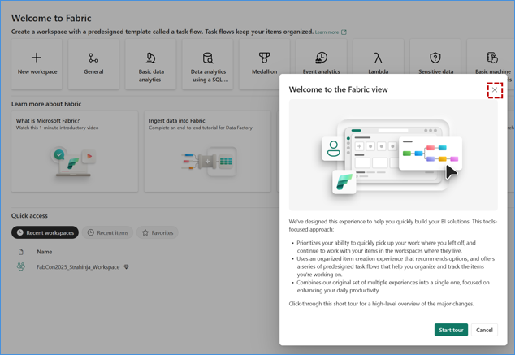

3. You can safely ignore any notifications about a Microsoft **Fabric** (Free) license being assigned.

#### 02: Set up a Fabric workspace with proper capacity

1. In the upper left area of the screen, select the **New workspace** tile to open the **Create a workspace** blade.

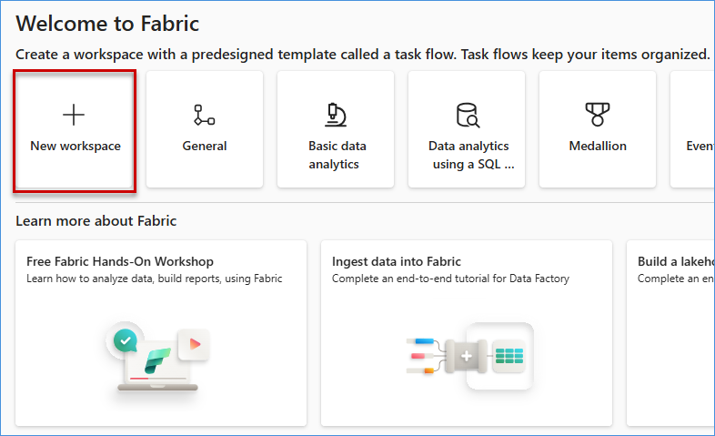

2. On the **Create a workspace** blade, in the Name field, enter `workspace62409186`.

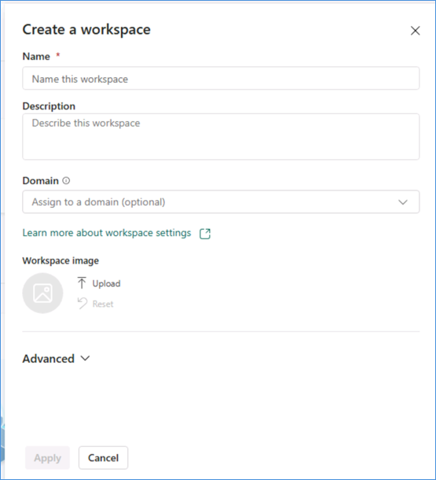

3. You can safely ignore any messages about PREMIUM CAPACITY SETTINGS.
4. Select **Advanced** and scroll down to see the License mode. Ensure that **Fabric** is selected.

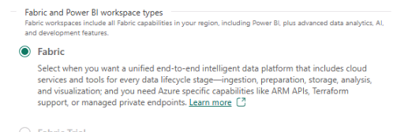

5. Next, on the bottom left of the **Create a workspace** blade select the green **Apply** button.

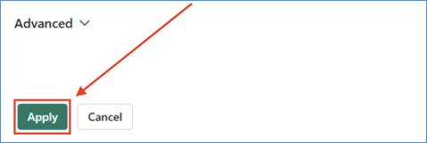

6. On the following page, you may get a pop-up titled "Introducing task flows (preview)." Select the green Got it button.

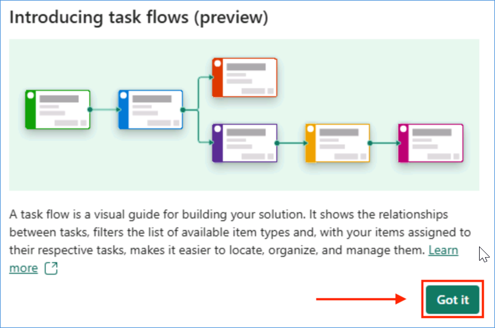

## Exercise 02: Generate ontology data

In this exercise, you'll create a **Fabric** **Lakehouse** and an **Eventhouse** and integrate batch and real-time data into a unified platform. The **Lakehouse** provides scalable storage and the **Eventhouse** processes streaming data, enabling **Ontology** IQ to understand business entities, metrics, and relationships for intelligent AI-driven analytics.
Eva will ingest data from multiple enterprise and operational sources, including:

- Store Inventory Systems
- Online Sales Platforms
- Campaign Management Systems
- Historical Stock-out Data

All ingested data is consolidated into Microsoft OneLake, eliminating data silos and enabling a unified data foundation for analytics and AI-driven insights.

### Outcome

- **Lakehouse** successfully created.
- Structured tables prepared for data modeling
- Foundational layer established for business semantics

### Task 01: Build a Lakehouse

### Description

In this task, you'll create a **Fabric** **Lakehouse** that serves as the foundational storage layer for the workshop. The **Lakehouse** will store both structured retail data and ontology-related files, enabling unified access for analytics and downstream AI-driven workloads.

### Success criteria

- You successfully created a new **Lakehouse** in the **Fabric** workspace.
- The **Lakehouse** has **Tables** and **Files** sections available.
- Required ontology package files are uploaded successfully into the **Lakehouse**.
- The **Files** section displays both uploaded files correctly.

### Key tasks

1. In this task of the workshop, you'll be creating a **Lakehouse**.
2. Select the workspaces option and choose the `workspace62409186` workspace.

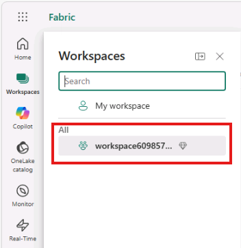

3. Select **+ New item**, then select **Lakehouse** from the available options.

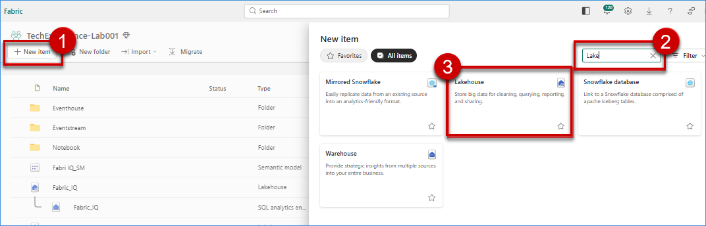

4. In the New **Lakehouse** dialog box, in the Name field, enter `Retail_Lakehouse`, and ensure the **Lakehouse schemas** option is enabled.

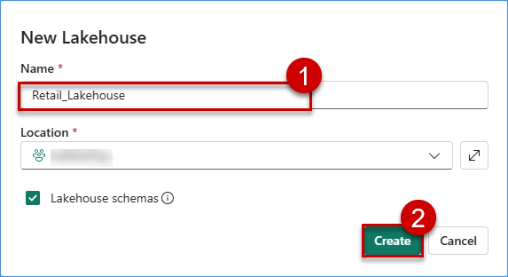

5. Workspace will be selected by default. Otherwise, select the appropriate workspace.
6. Select **Create**.
7. Wait for the **Lakehouse** to be successfully provisioned. Once created, the **Lakehouse** will open automatically.
8. Verify that the **Tables** and **Files** sections are available.

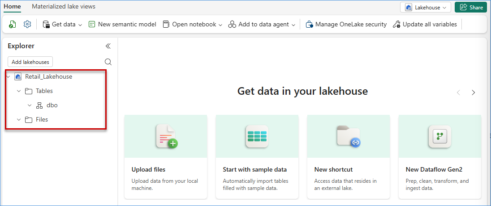

9. Both **Tables** and **Files** sections are currently empty.
10. To upload files, select … in the **Files** section. Hover over the **Upload** option and select the **Upload files** option.

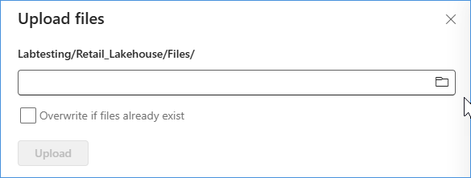

11. Select the folder icon on the right side to open and choose file path.

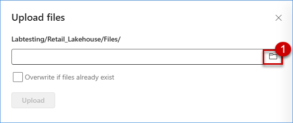

12. To browse the files from your virtual machine, open File Explorer. Select the address bar, and enter the path `C:\Lab Assets\Ontology`.

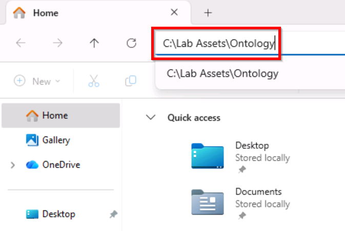

13. Select the `retail_ontology_package.iq` and `fabriciq_ontology_accelerator-0.1.0-py3-none-any.whl` files and select **Upload**.

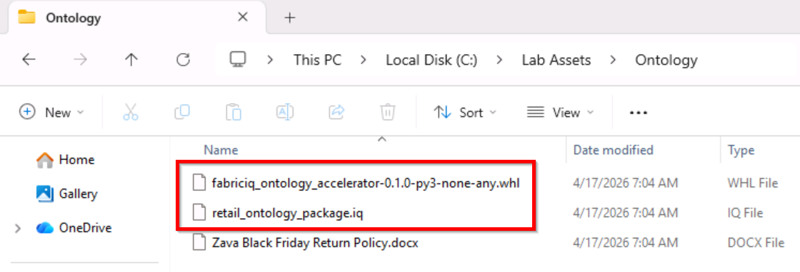

14. Once both files have been uploaded, you can close the upload window.

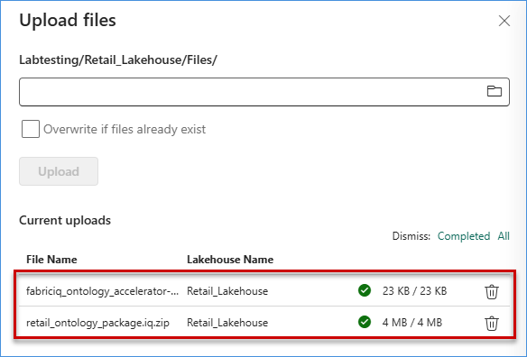

15. On the Explorer pane on the left, select **Files**.

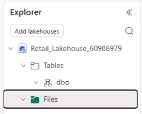

16. The **Files** section of the **Lakehouse** should show both files.

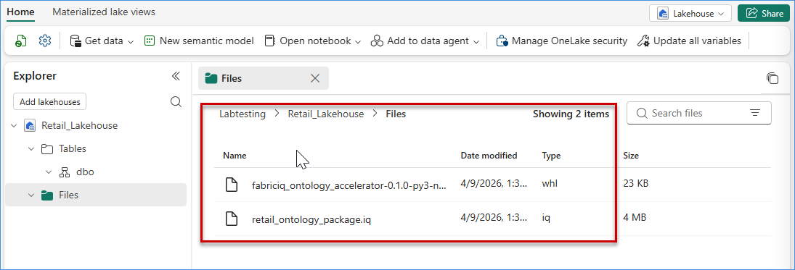

#### Understand the uploaded files

`retail_ontology_package.iq` is a ZIP-based package. The .iq extension is added so the **Fabric** IQ workflow can recognize it as an ontology package. It contains structured definition of ontology to bind source static data for the **Lakehouse**, and time-series operational data that will later be loaded into the **Eventhouse**.
`fabriciq_ontology_accelerator-0.1.0-py3-none-any.whl` is a Python helper library used within the notebook workflow to process the ontology package and generate data in the **Lakehouse** and Warehouse. It provides the necessary execution logic to read the package and load the data accordingly.

#### What is inside retail_ontology_package.iq?

The package is organized into four folders: instance_data, events_data, definition, and binding.
- `instance_data`: Holds data files which contain the batch and transactional retail data that are loaded into the **Lakehouse**. For our lab, you have considered the below entities:
- `carriers.csv`: Stores logistics provider details; used to track shipping partners, delivery performance, and transportation assignments.
- `customers.csv`: Contains customer profiles; supports segmentation, behavior analysis, personalization, and customer-centric reporting.
- `demand_signals.csv`: Captures batch data on demand indicators; used for trend detection, demand spikes, and responsive supply chain decisions.
- `forecasts.csv`: Stores predicted demand values; enables planning, budgeting, and comparison against actual sales performance.
- `inventories.csv`: Tracks stock levels across locations; supports replenishment, stock optimization, and inventory availability analysis.
- `orders.csv`: Stores customer transaction records; enables revenue tracking, order lifecycle monitoring, and sales analytics.
- `order_lines.csv`: Contains individual items within orders; used for detailed sales, pricing, and product-level analysis.
- `product_categories.csv`: Defines product groupings; supports hierarchical classification, category-level reporting, and assortment analysis.
- `products.csv`: Holds product details; enables performance tracking, pricing analysis, and inventory-product relationships.
- `promotions.csv`: Stores campaign and discount data; supports effectiveness analysis, uplift measurement, and marketing optimization.
- `regions.csv`: Defines geographic hierarchies; enables regional performance analysis and location-based business insights.
- `returns.csv`: Tracks returned items; supports return rate analysis, quality issues identification, and reverse logistics.
- `shipments.csv`: Stores shipment records; enables delivery tracking, fulfillment analysis, and logistics performance monitoring.
- `stores.csv`: Contains retail store details; supports store-level performance, operations analysis, and location-based insights.
- `warehouses.csv`: Stores warehouse information; supports storage management, inventory distribution, and supply chain optimization.
- `events_data`: Holds data files which contain the real-time (Timeseries) data that are loaded into the **Eventhouse**. For your lab, you have considered below entities:
- `forecasts.csv`: Continuously updated demand predictions; integrates real-time signals to refine forecasting accuracy and support dynamic planning decisions.
- `inventories.csv`: Tracks real-time stock levels; enables instant visibility into availability, replenishment needs, and inventory movement across locations.
- `products.csv`: Maintains product activity data; supports real-time tracking of performance, availability, and demand-driven product insights.
- `definition`: Holds entity definition and its relationship details.
- `entity_types.csv`: Capture both batch and real-time entities and its attributes along with identity and time-series column
- `relationship_types.csv`: Defines the logical relationships between entity types.
- `binding`: Holds entity binding and its relationship which is required to build **Ontology**.
- `binding_entity_types.csv`: Maps ontology properties to the physical source tables and columns in the **Lakehouse** or **Eventhouse**, including time-series binding details.
- `binding_relationship_types.csv`: Maps ontology relationships to the source tables and join keys used to connect entities.
In summary, the .iq file provides the business model and packaged sample data, while the .whl file provides the parametrized execution logic that processes that package and loads data into **Fabric** services.

### Task 02: Build an Eventhouse

### Description

In this task, you'll provision a new **Eventhouse** within the **Fabric** workspace and prepare it for streaming data ingestion. The **Eventhouse** will serve as a high-throughput analytics layer, enabling real-time visibility into business events such as inventory and sales performance.

### Success criteria

- You successfully created a new **Eventhouse** in the **Fabric** workspace.
- The **Eventhouse** dashboard is accessible with a default KQL database.
- You retrieved and copied the **Eventhouse** URI.
- The **Eventhouse** is ready for data ingestion and query execution.
In this section, you will create an **Eventhouse**, ingest streaming events, and enable fast KQL-based queries for live dashboards and operational intelligence.

April (CEO) requires real-time visibility into inventory performance. To address this need, Eva enhances the data model with:

- **Eventhouse** for high-throughput event data storage.
- Streaming inventory updates.
- An operations agent to detect and monitor anomalies in real time.

> "Don't tell me about yesterday's stock outs - tell me before they happen."

### Outcome

- Creating **Eventhouse**
- Loading real-time data in the **Eventhouse** kusto table
- Making KQL-powered queries available for live dashboards

### Key tasks

1. Select the Workspaces option and choose the `workspace62409186` workspace.


2. Select **+ New item**, then **Eventhouse** from the available options.

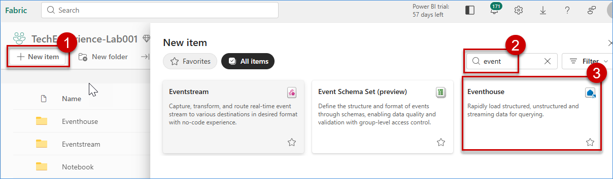

3. For the **Eventhouse** name, enter `Retail_Eventhouse`, and then select **Create**.

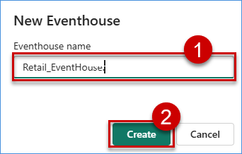

4. Wait a few moments for the **Eventhouse** to be created. Once it's created, you'll be redirected to the dashboard. The KQL database will be created by default.

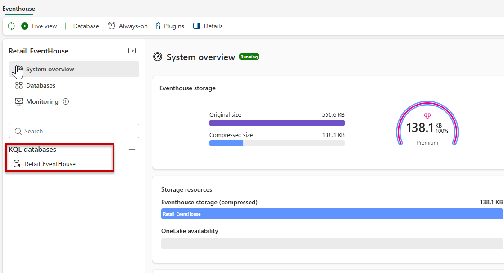

5. At the moment you have an empty database.
6. Navigate to the right side to locate **Eventhouse** Details and copy **Query URI**.

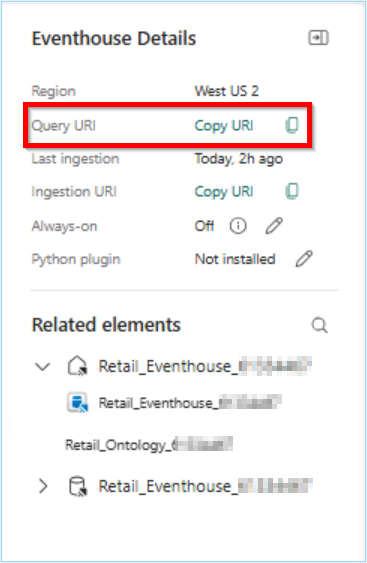

7. In the **Eventhouse** Details, select **Query URI**, and save it in notepad

### Task 03: Load data into Lakehouse and Eventhouse

### Description

In this task, you'll import a prebuilt notebook into the **Fabric** workspace, configure it with the appropriate **Lakehouse** and **Eventhouse** settings, and execute it to load data. The notebook processes the ontology package, populates the **Lakehouse** with structured data, and streams real-time data into the **Eventhouse** for KQL-based querying and analysis.

### Success criteria

- You successfully imported the notebook into the **Fabric** workspace.
- The notebook is correctly configured with the **Lakehouse** and **Eventhouse**.
- The notebook executed successfully without errors.
- Data is loaded into both the **Lakehouse** and **Eventhouse**.
- **Tables** are visible and validated in both environments.

### Key tasks

#### 01: Import notebook

1. Navigate to your **Fabric** workspace.
2. On the workspace homepage, select the **Import** option.
3. From the available options, select **Notebook**.
4. Choose **From this computer** as the source.

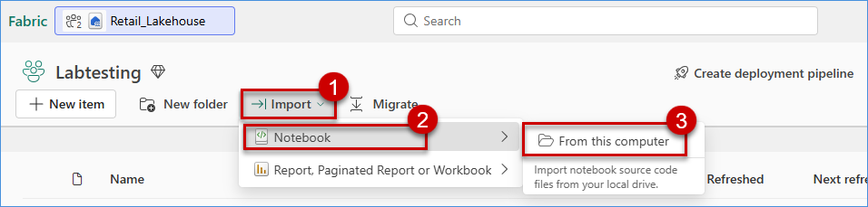

5. Select **Upload** to import the notebook.

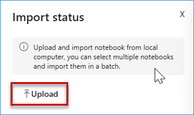

6. To browse the notebooks from your virtual machine, open File Explorer. Select the address bar, enter the path `C:\Lab Assets\Notebook`, select the `Generate Ontology Data` notebook file, and then select Open.

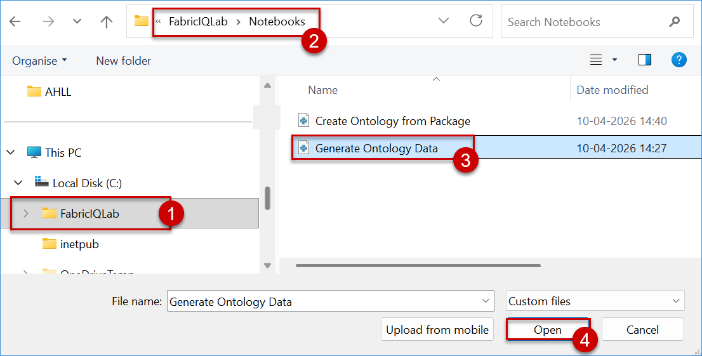

7. After uploading, the notebook will be listed in the workspace area.


#### 02: Execute notebook

1. Select the `Generate Ontology Data` notebook from the list.

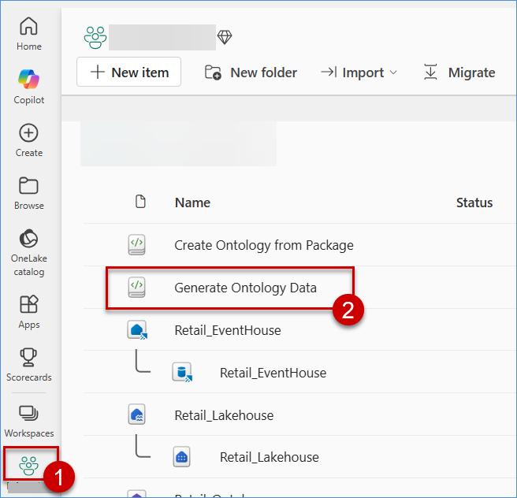

2. The notebook will open in a new tab without being bound to any datastore.(**Lakehouse**)

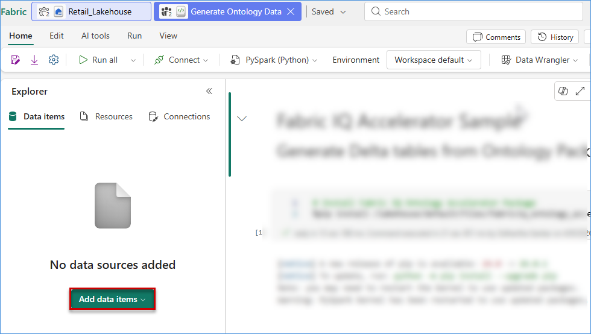

3. Select **Add data items**, then select **From OneLake catalog** to open OneLake areas.

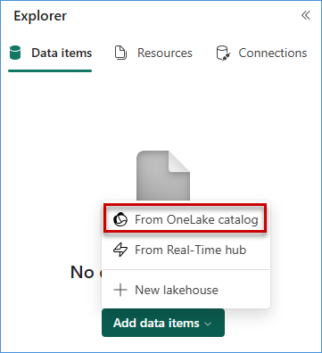

4. Select the `Retail_Lakehouse` **Lakehouse**, then select Add to include in the notebook execution.

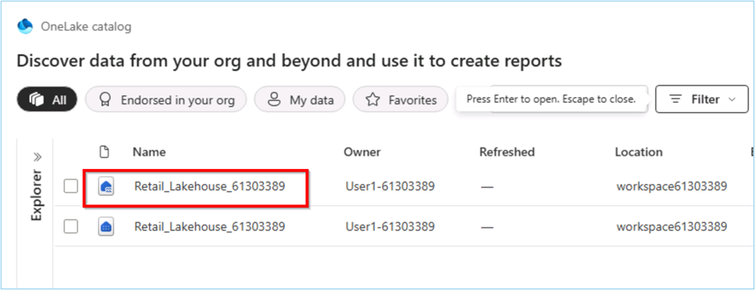

5. The selected **Lakehouse** will now be bound to the **Notebook**.

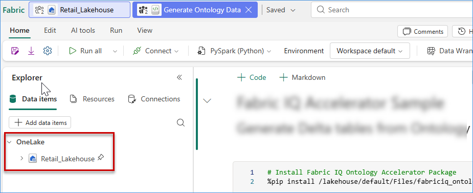

6. Now, you can run this notebook.
7. For the notebook configuration, please move to the last cell (**Create** Kusto tables) and replace the following values:

| Value | Replacement |
| --- | --- |
| Cluster_url (excluding <>) | <Copy Eventhouse Cluster URL |
| Event house databasename(by default it is event h) (excluding <>) | Retail_Eventhouse |

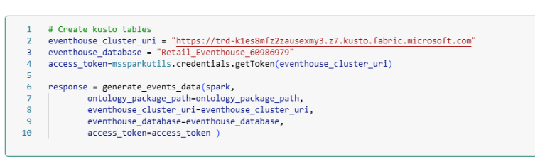

8. You must insert the text above in between the "" (quotes). Please ensure that you do not include the <> symbols at the beginning and end.
9. After configuration, select **Run all** on the top banner and execute the entire notebook cell by cell.
10. First cell will install .whl file to execute all referenced files.
11. Second cell will execute ontology package and load data in the **Lakehouse**.

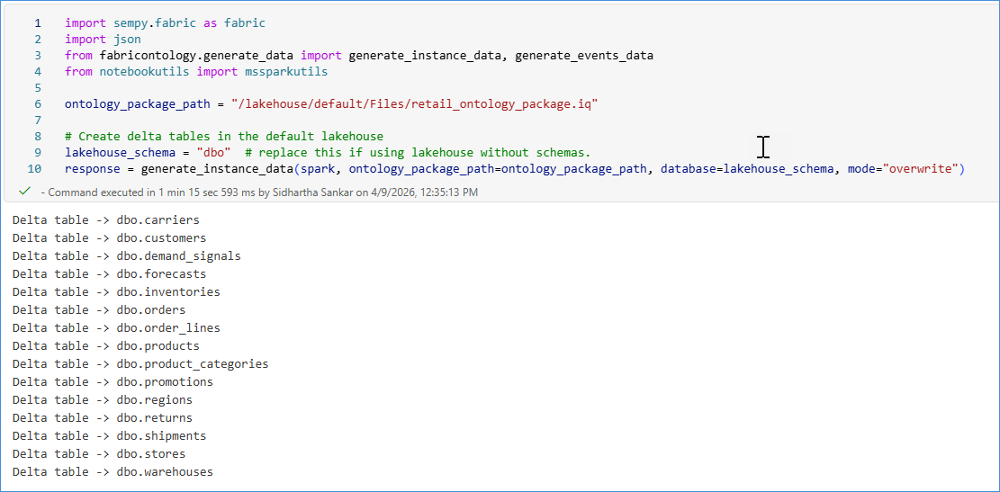

12. Third and last cell will load data in the **Eventhouse**.

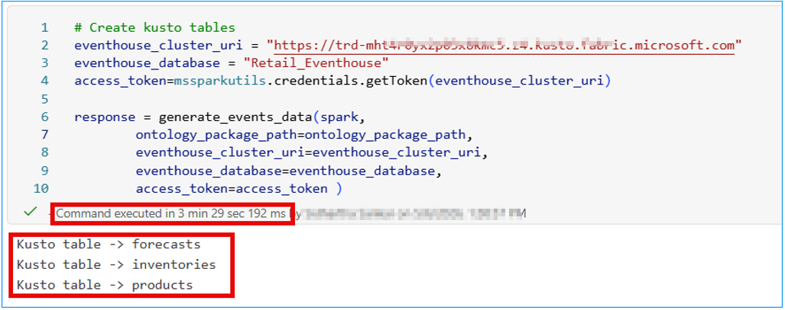

13. It will take several minutes to complete the execution. Wait for all cells to complete.

#### 03: Validate Lakehouse and Eventhouse data.

1. Navigate back to the **Fabric** workspace `workspace62409186`, open the previously created **Lakehouse**, and confirm that the data has been loaded successfully.

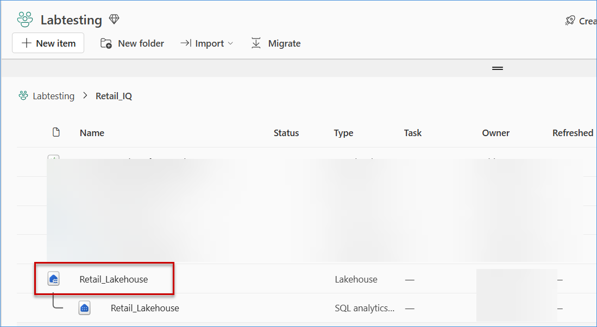

2. Go to the **Tables** section and select the three dots (⋯) menu, then Refresh to load all tables under the dbo schema.

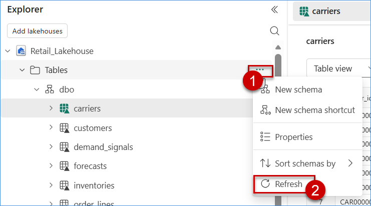

3. Verify that tables are created automatically.

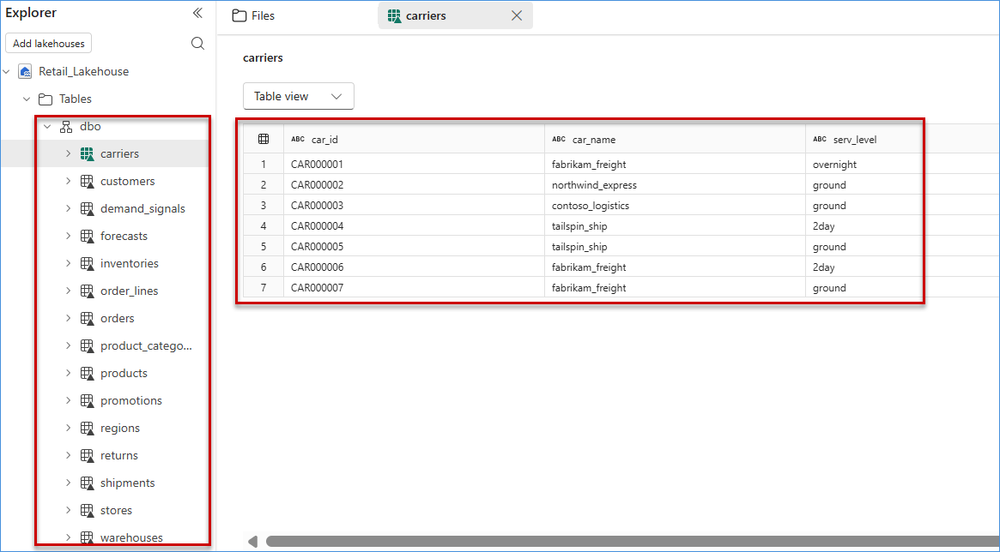

4. Navigate back to your **Fabric** workspace `workspace62409186`, open the **Eventhouse** created earlier, and verify that the data has been successfully loaded.

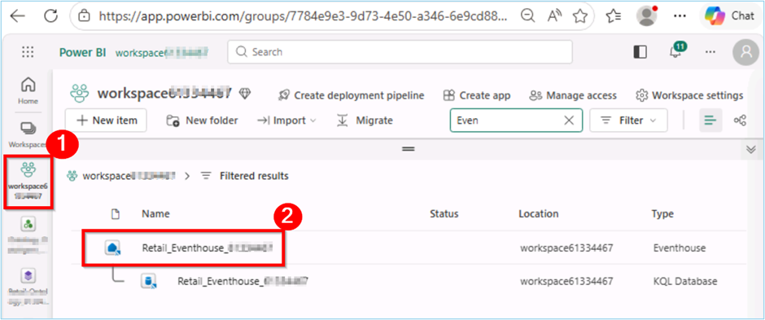

5. Select the KQL database and select the Refresh icon in the top-left corner to view all real-time tables.

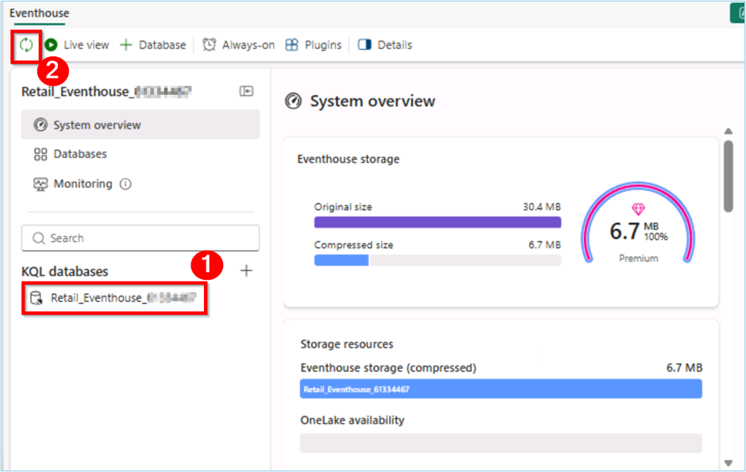

## Exercise 03: Create ontology

In this section, you'll build an **Ontology** from the previously created **Lakehouse** and **Eventhouse** with bound attributes to map datasets into governed entities and relationships. This forms the foundation for data agents and enables context-aware analytics across the enterprise.
**Ontology** IQ introduces a business-centric semantic layer that defines entities, relationships, and contextual meaning - enabling intuitive data discovery and accurate natural language insights. This marks a breakthrough moment in transitioning from structured data to business-understandable intelligence.
Eva generates a **Fabric** IQ **Ontology** that:

- Manages customer data and marketing interactions.
- Defines products, product categories, and assortment performance.
- Supports demand forecasting and trend analysis.
- Manages inventory, logistics, and supply operations.
- Tracks store performance and operational activities.
- Defines regions for geographic performance analysis.

> "This is how our business actually works - not just how data is stored."

### Outcome

- **Ontology** successfully created.
- Graph view of business relationships established.
- AI-ready business language layer enabled for Data Agents.

### Task 01: Generate Ontology from package

### Description

In this task, you'll create an **Ontology** in Microsoft **Fabric** by importing and executing a prebuilt notebook. The **Ontology** will be generated from the previously created **Lakehouse** and **Eventhouse**, establishing a semantic layer that defines governed entities, relationships, and business context.

### Success criteria

- You successfully imported the ontology creation notebook into the workspace.
- The notebook is correctly configured with **Lakehouse** and **Eventhouse** settings.
- The notebook executed successfully and generated an **Ontology**.
- The **Ontology** is visible in the workspace.
- Entities, relationships, and bindings are correctly displayed in the **Ontology** view.

### Key tasks

#### 01: Import notebook

1. Navigate to your **Fabric** workspace.
2. On the workspace homepage, select the **Import** option.
3. From the available options, select **Notebook**.
4. Choose **From this computer** as the source.


5. Select **Upload** to import the notebook.


6. To browse the notebooks from your virtual machine, open File Explorer. Select the address bar, enter the path `C:\Lab Assets\Notebook`, select the `Create Ontology from Package` notebook file and then select Open.

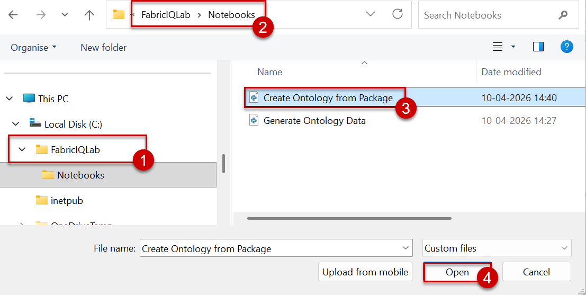

7. After upload, the notebook will be listed in the workspace area.

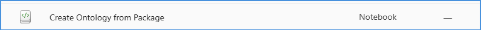

#### 02: Execute notebook

1. Select the `Create Ontology from Package` notebook from the list.

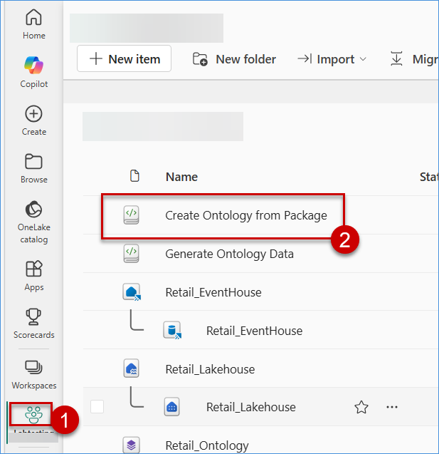

2. The notebook will open in a different tab without binding with any datastore (**Lakehouse**).


3. Select **Add data items**, then select **From OneLake catalog** to open OneLake areas.


4. Select the previously-created **Lakehouse**, then select Add to include in the notebook execution.

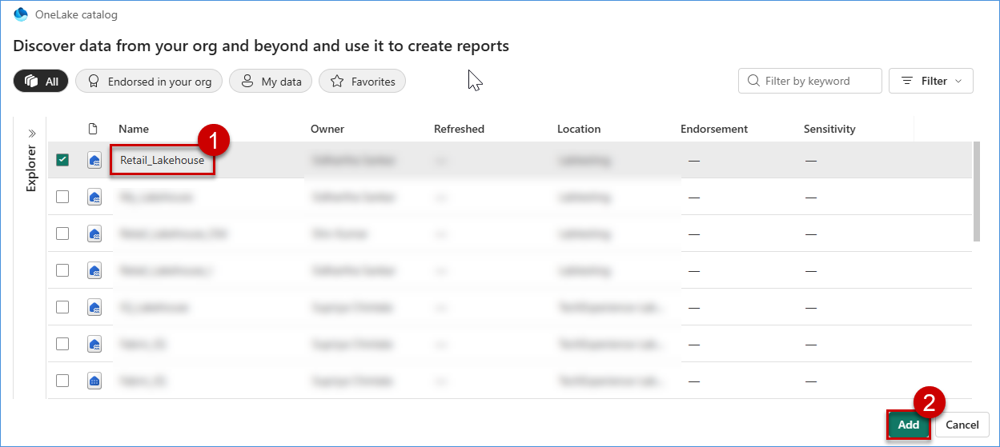

5. Now the selected **Lakehouse** will be bound to the notebook.


6. For notebook configuration, go to the **third cell** and update only these values:

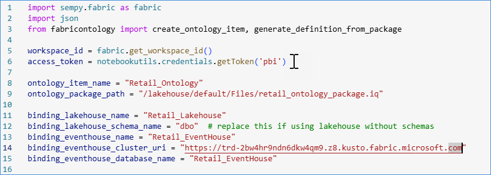

| Option | Value |
| --- | --- |
| `cluster_url` | Your Eventhouse Query URI |
| `eventhouse_database` | Your Eventhouse/KQL database name |

7. You must insert the text above in between the "" (quotes). Please ensure that you do not include the <> symbols at the beginning and end.
8. After configuration, select **Run all** on the top banner and execute entire notebook cell by cell.
9. The first cell will install .whl file to execute all refrerenced files.
10. The second cell will execute the **Ontology** package to create **Ontology**.
11. Below is the response from a successful run:

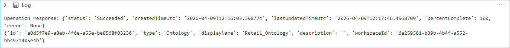

12. Navigate to the workspace area to see the new **Ontology** created.

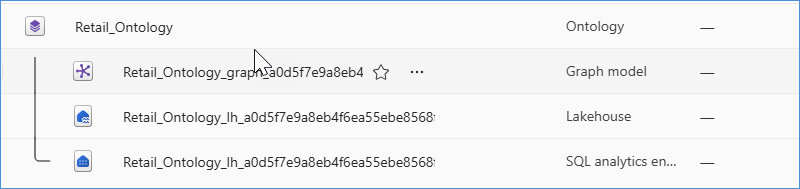

13. Select **Ontology**. You'll be redirected to a different page to see its details.

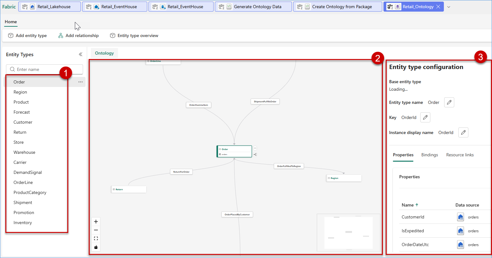

14. The left area will display all entities bound to the **Lakehouse** and **Eventhouse**.
15. Middle area will provide relational view of each selected entity.
16. Right area will show its properties and binding details.

### Task 02: Ontology validation

### Description

In this task, you'll validate the generated **Ontology** by exploring its entities, relationships, properties, and data bindings. This helps ensure that the semantic model correctly reflects both static and real-time data sources.

### Success criteria

- You successfully selected and explored an entity within the **Ontology**.
- Entity relationships are correctly visible and validated.
- **Properties** display attributes bound to both **Lakehouse** and **Eventhouse**.
- Data bindings (static and time-series) are correctly configured and verified.

### Key tasks

1. To validate each entity and its details, please select any of them. In the below case, I have selected Product.
2. The product entity builds relationship with "OrderLine", "Shipment", "Region", "Customer", and "Return."

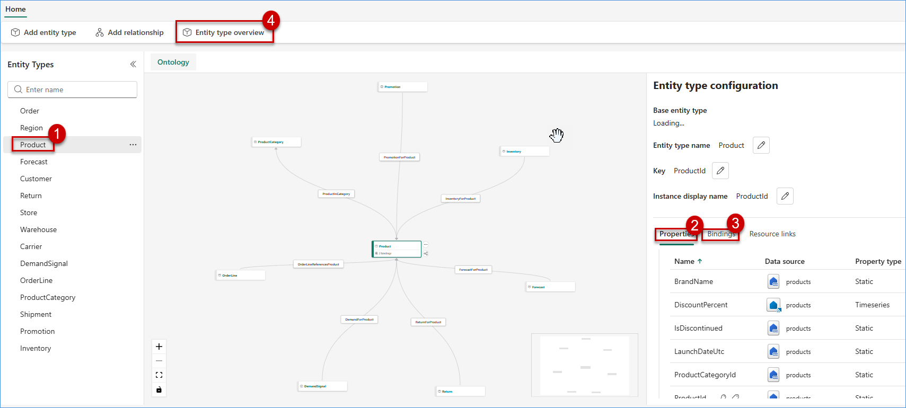

3. Select **Properties** from the right-side configuration area to view all attribute details bound to the **Lakehouse** (static) and **Eventhouse** (time-series).

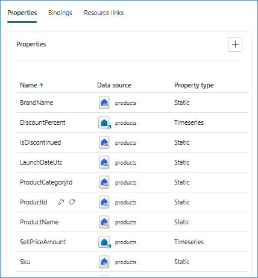

4. Select **Bindings** to validate both status and time-series data binding.

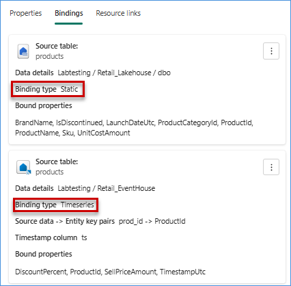

5. Select **Entity type overview** on the top banner to see the graph views.

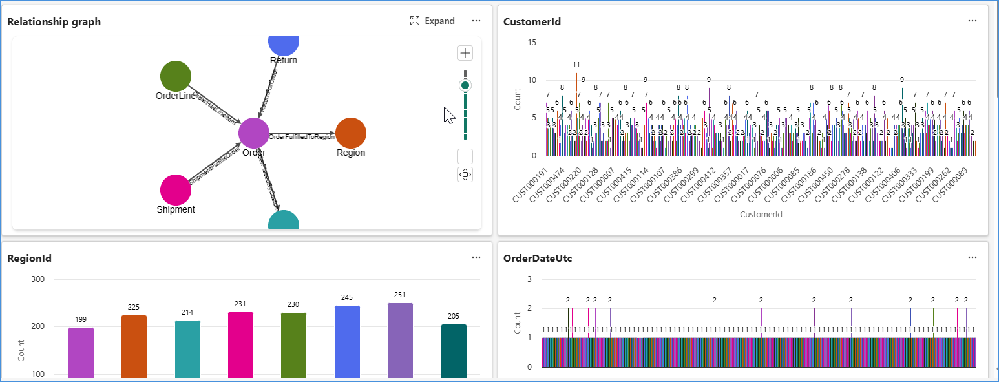

6. Please validate attribute details which were provision for static and timeseries.

## Exercise 04: Create a data agent with Ontology

In this section, you'll create a **Fabric** data agent and connect it to the **Ontology** to enable natural language queries for retrieving business insights from enterprise data.
Serena (data analyst) now asks:
"Which stores had the highest stock outs and highest demand last quarter?" Instead of writing complex SQL queries, Serena interacts directly with a **Fabric** data agent that is grounded in the **Ontology** - enabling intuitive, context-aware analytics using natural language.

### Outcome

- **Fabric** data agent successfully connected to the **Ontology**.
- Cross-domain insights generated using natural language queries.
- Trusted and explainable responses powered by governed business context.

### Task 01: Create a data agent with an Ontology as the data source

### Description

In this task, you'll create a **Fabric** data agent and connect it to the previously built **Ontology**. This enables natural language interaction with governed enterprise data through a semantic layer.

### Success criteria

- You successfully created a new data agent in the **Fabric** workspace.
- The data agent is correctly named and configured.
- The **Ontology** is successfully attached as the data source.
- The agent is ready for natural language querying using governed data context.

### Key tasks

#### 01: Create a new agent

1. Navigate to your **Fabric** workspace.
2. In your **Fabric** workspace, select New item on the top command bar.
3. On the New item creation pane, enter **Data Agent** in the search bar field.
4. Select the data agent card in the search results to initiate creation.

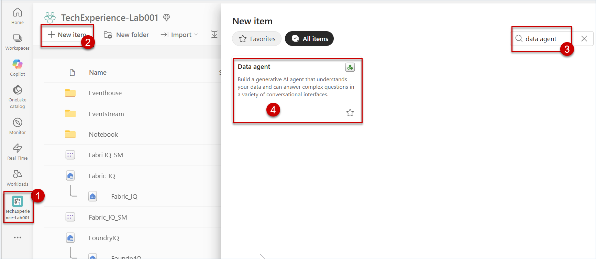

5. Paste `Ontology_DataAgent` in the **Create** data agent field and then select **Create**.


#### 02: Attach Ontology as data source

1. Once the data agent opens, navigate to the Data tab on the Explorer pane, select Add Data, select Data source, then look for and select the **Ontology** created in the previous lab.


2. Choose the **Ontology** created in the previous lab, then select Add and verify that the **Ontology** is successfully attached.


3. The **Ontology** acts as a semantic layer, helping the data agent understand the data context.
4. Ensure the correct **Ontology** is selected to get accurate insights.

### Task 02: Validate the data agent using natural language queries

### Description

In this task, you'll configure and test a **Fabric** data agent by verifying its connection to the **Ontology** and defining its behavior using structured instructions. This enables the agent to respond to business questions using governed enterprise data.

### Success criteria

- You successfully verified that the **Ontology** is attached under the Data tab.
- You configured and saved the agent instructions.
- The data agent is published successfully.
- The agent is able to process and respond to natural language queries using **Ontology** context.
- Query responses reflect correct interpretation of business logic and data relationships.

### Key tasks

1. Verify that the **Ontology** (e.g., Retail_Ontology) is successfully added under the Data tab in the Explorer pane.


2. Select **Agent instructions** on the top menu.


3. In the **Agent instructions** section, remove any existing default content present in the instructions box and provide guidance to control how the agent responds by entering instructions.

#### Sample agent instructions (copy & paste)

Copy the instructions below and paste them into the **Agent instructions** section:

```markdown
**Purpose:**
This data agent is designed to answer analytical and operational questions for retail business users using the Retail_Ontology, which integrates Lakehouse (historical) and Eventhouse (real-time) data.

**Planning Rules**
- Understand the user intent: classify into Sales, Inventory, Customer, Promotion, Supply Chain, or Forecasting.
- Identify whether the question requires historical analysis (Lakehouse entities) or real-time / near real-time insights (Eventhouse entities).
- Break complex queries into entity identification, relationship traversal, and metric aggregation.
- Always validate time filters and granularity.

**Data Source Mapping**
- Sales & Orders: Order, OrderLine -> revenue, quantity, transactions.
- Customer Insights: Customer -> segmentation, behavior.
- Product Analysis: Product, ProductCategory -> product performance.
- Inventory & Supply Chain: Inventory, Shipment, Warehouse, Store -> stock levels, fulfillment.
- Promotions: Promotion -> campaign effectiveness.
- Returns: Return -> return rates, defects.
- Forecast & Demand: Forecast -> planned demand; DemandSignal (Eventhouse) -> real-time demand spikes.
- Geography: Region -> regional performance.

**Terminology Standardization**
- Revenue = Sum(OrderLine.LineTotalAmount)
- Sales Volume = Sum(OrderLine.quantity)
- Inventory Level = Available stock in Inventory
- Demand = Forecast or DemandSignal depending on context
- Conversion Rate = Orders / Customers
- Return Rate = Returns / Orders

**Query Behavior Rules**
- Prefer aggregated insights over raw data unless explicitly requested.
- Always apply relevant filters and use ontology relationships.
- For ambiguous queries, ask clarifying questions or provide a best assumption with explanation.

**Response Style**
- Use clear, business-friendly explanations.
- Include key insights, supporting metrics, and trends when time-based.
- Highlight anomalies or patterns.
- Avoid overly technical database language.
```

After entering the instructions, select **Publish** to save the configuration.


On the **Publish** data agent popup, select **Publish**.


After adding the instructions, select the close (✕) icon on the **Agent instructions** tab to exit the window.


Once closed, the main data agent interface will be displayed where you can start querying the agent using natural language.
In the query input area, ask questions using natural language, for example:
- Which customer generated the highest total sales amount?
If the data agent is not responding, please refresh your **Fabric**/**Data Agent** tab in the VM browser and try the prompt again.


Submit the query and review the response generated by the data agent.


Observe how the agent:

- Interprets the question.
- Queries the underlying data using the ontology.
- Provides insights in a readable format.

Try multiple queries and refine your questions to explore additional insights:

- Which products are frequently returned and impacting revenue?
- Which regions are underperforming in sales?
- Which products are at risk of stockout?
- Which stores have the highest number of orders?

Clear and specific questions provide more accurate results. Responses may vary depending on how the question is framed. The data agent uses the **Ontology** to translate natural language into meaningful queries.

## Exercise 05: Create an operations agent (This exercise to work you need PowerAutomate and Teams)

In this section of the workshop, you'll create an operations agent pointing to **Eventhouse**.
April (CEO) requires real-time visibility on sales order and customer insight along with product inventory analysis and performance.
To address this need, Eva enhances the data model with:

- **Eventhouse** for high-throughput event data storage.
- Streaming inventory updates.
- An **Operations Agent** to detect and monitor anomalies in real time.

> "Don't tell me about yesterday's stock outs - tell me before they happen."

### Outcome

- Real-time monitoring enabled.
- KQL-powered queries available for live dashboards.
- Proactive operational intelligence for promotional performance.
- RTI dashboard supports live decisions.

### Task 01: Create operations agent (Fabric IQ)

### Description

In this task, you'll create and configure an operations agent in Microsoft **Fabric** to enable real-time monitoring of business data. The agent will use **Eventhouse** data and predefined business rules to detect anomalies and generate automated alerts for proactive decision-making.

### Success criteria

- You successfully created an operations agent in the **Fabric** workspace.
- The business goal and agent instructions are correctly configured.
- The **Eventhouse** is added as the knowledge source.
- The agent playbook is generated and saved successfully.
- The operations agent is started and actively monitoring data for anomalies.

### Key tasks

1. Select **Fabric** Workspace, then New Item.
2. In the search box, enter Operations agent as the keyword to get to operation agent. Select Operation Agent.


3. On the New operations agent popup, in the Name field, enter `OperationsAgent_62409186`, and then select **Create**.


4. After you create it, the operation agent will load its blank play area.


5. The operation agent has sections such as Business goal, **Agent instructions**, Knowledge, and Action. On the right side you have the Agent playbook area.
6. Provide a Business goal for RTI.
7. Provide this Business goal for RTI:

```text
Enable proactive, AI-driven sales intelligence to:
- Detect low confidence and unreliable forecasts.
- Identify sudden demand spikes or drops.
- Ensure timely and accurate forecast availability.
- Support proactive inventory and supply planning.
```


8. Provide these agent instructions:

```text
Objective:
Monitor the forecasts table in Eventhouse to evaluate forecast accuracy, detect anomalies in demand predictions, and track forecast confidence. Provide structured alerts with recommended actions.

Knowledge Data Source:
Database: Retail_Eventhouse
Table: forecasts
Columns: fcst_id, fcst_units, fcst_amt, fcst_conf_pct, ts

Monitoring Logic:
IF fcst_conf_pct < 0.15 THEN
  Classify the Risk Level as "Critical", generate an immediate alert, and indicate "Low Confidence Forecast".
IF fcst_conf_pct < 0.70 THEN
  Classify the Risk Level as "High Risk", generate an immediate alert, and indicate "Average Confidence Forecast".
IF none of the above conditions are met THEN
  Classify the Risk Level as "Normal" and do not generate an alert.
CONTINUE monitoring.

Alert Requirements:
For each Critical, High Risk, or High Opportunity event, send alerts including:
- fcst_id
- fcst_units
- fcst_amt
- fcst_conf_pct
- Risk Level
- Alert Message
```


9. Add a knowledge base in the Knowledge section. Select Add data.


10. Choose `Retail_Eventhouse` and select Add to add in the knowledge section.


11. After selecting **Add** you can see knowledge base.


### Task 02: Observe agent behavior in real-time

### Description

You'll define a custom action, connect it to an Activator flow, and configure **Microsoft Teams** to send notifications when the agent detects relevant conditions. This enables automated, real-time communication from the operations agent.

### Success criteria

- Custom action is created and connected to Activator.
- **Microsoft Teams** integration is configured successfully.
- Playbook is generated, saved, and the agent is started successfully.

### Key tasks

1. **Create** a custom action by selecting Add action.


2. For the action name, enter `Inventory_Action_62409186`.
3. For the action description, enter Inventory action is a custom action. While action is required, Activator will trigger this action to send a message/email to the authorized operation team.
4. Select **Create**.


5. Now, custom actions will be created for operation agents.


6. Scroll to the right of the newly created action and select Connect to configure.
7. On the worskpace dropdown, select `workspace62409186`.
8. Select the Activator dropdown, then **Create** a new item.
9. In the New item name field, enter `Forecast_Activator_62409186`, and then select **Create Activator**.
10. Select **Create a connection**


11. Select Copy to the right of the connection string, and paste it into the text box below.
12. Select **Open flow builder**.


13. If you see an error that the flow could not load, wait a few minutes and then attempt to reload the page.


14. On the When an activator rule is triggered box, select Invalid parameters to open the configuration flyout.


15. Enter the connection string .


16. On the same flyout, select Change Connection.


17. On the Change connection flyout, select Add new, and then select Sign in.


18. Select your user account `User1-62409186@LODSPRODMCA.onmicrosoft.com`.


19. Select the + plus sign under the existing box.


20. In the Add an action search bar, enter **Teams**.
21. Next to **Microsoft Teams**, select See more to display all available choices.


22. Select Post message in a chat or channel.


23. On the **Create connection** flyout, select Sign in.


24. Select you user account `User1-62409186@LODSPRODMCA.onmicrosoft.com`.


25. On the Post message in a chat or channel flyout, select the following options:

| Object | Value |
| --- | --- |
| Post as | Flow bot |
| Post in | Chat with Flow bot |
| Recipient | User1-62409186@LODSPRODMCA.onmicrosoft.com |
| Message | Hi Mark, as per your advice, we have increased the stock count for the product. |
26. On the upper-right side of the bar's menu, select **Save**.


27. Return to the **Fabric** tab in your browser.


28. Select **Apply**.


29. If the apply button is not available to select, wait for the status to change to Connected.


30. Select **Generate playbook**.


31. If the failbook fails to generate, select **Generate playbook** again.
32. Review the playbook, and then select **Save**.


33. Start the operation agent.


34. Open **Microsoft Teams** by creating a new tab in your Edge browser and connecting to https://teams.microsoft.com/v2/?skipauthstrap=1.
35. Activate the **Fabric** operations agent by navigating to Apps in the **Microsoft Teams** left pane and searching for **Fabric** operations agent.


36. Select Add.


37. Select Open to launch the **Fabric** operation agent card in your **Teams** environment.


38. Now, the operation agent is ready to track, monitor, and send alert messages if any anomalies are detected.

#### Steps to process streaming data and validate anomalies

1. Nagivate back to the **Fabric** workspace `workspace62409186` and open the KQL database `Retail_Eventhouse_62409186`.


2. Select your database `Retail_Eventhouse`.
3. Select **KQL Queryset**, and then select **Create**.


4. If any pop-up window appears, please close it.


5. Remove any pre-existing queries from the editor.


#### Ingest data into forecast table

1. Paste the code below and run the following KQL command to ingest data into the forecasts table:


```kql
.ingest inline into table forecasts <|
"FCST000627", 60, 75.25, 0.10, datetime(2025-12-30T10:50:00)
"FCST000626", 55, 66.5, 0.00, datetime(2026-01-30T10:50:00)
```

2. Paste the code below under the existing code and run only this validation query:

```kql
forecasts
| where ingestion_time() > ago(5m)
```

When you run the second command, highlight only that query rather than running the entire block. Always ensure only the required query is highlighted before selecting **Run**.


3. Navigate back to your **Microsoft Teams** tab.
4. Open the chats **Fabric** operation agent. You should see alert messages displaying forecast results, including low confidence anomaly alerts generated by the operation agent.
5. Select **Yes** to proceed with the recommended action.


6. Please wait a while and refresh the window for the **Teams** notification to appear.
7. The inventory action was successfully initiated using the provided parameters.


8. If you're unable to see the action message in **Teams**, please return to the **Fabric** browser tab, open the Operation Agent, and click Open in **Teams**.


9. You successfully ingested streaming forecast data into **Eventhouse** and verified that the data was being processed in real time. The operation agent continuously monitored this streaming data and automatically detected anomalies, including the test record with low confidence that was intentionally introduced for validation. As part of this process, the agent generated real-time alerts directly in **Microsoft Teams**, enabling immediate visibility into issues without manual monitoring. The solution also demonstrated how the operation agent provides recommended actions, such as triggering an inventory operation, allowing users to respond quickly and take corrective steps. Overall, this end-to-end workflow-from streaming data ingestion to anomaly detection, alerting, and action execution-shows how operation agents enable real-time intelligence and automated decision-making within a business scenario.

### Summary

This lab demonstrates how Microsoft **Fabric** IQ acts as an end-to-end intelligence layer, transforming fragmented enterprise data into trusted, business-aware insights using a unified platform.
Using the Zava retail scenario, the lab highlights how organizations move from siloed systems and inconsistent reporting to a centralized, governed intelligence foundation. Zava faces common challenges such as disconnected data across systems, slow decision-making, and lack of consistent business metrics.
To address these issues, **Fabric** integrates:

- **Lakehouse** (batch data).
- **Eventhouse** (real-time data).
- **Ontology** (business model).

These components are unified within OneLake, enabling centralized data storage, governance, and analytics.
At the core of this transformation is **Fabric** IQ, which introduces a shared business language by modeling data into:

- Entities (e.g., store, product, inventory).
- Relationships.
- Real-time operational signals.

This shifts analytics from technical structures (tables and SQL) to meaningful business context, understandable by both humans and AI.
The lab also showcases:

- Real-Time Intelligence (RTI).
- Operations monitoring agents.

These capabilities track live events, detect anomalies (such as inventory shortages), and enable proactive decision-making.
In the final stage, **Fabric** data agents connect to the **Ontology**, allowing users to:

- Ask natural language questions.
- Receive accurate, explainable insights.

These insights are fully grounded in the business model.

#### Key Outcome

The lab demonstrates how organizations evolve from **Raw Data** to **Unified Intelligence** to **Actionable Insights**.

This enables consistent, trusted decision-making across all personas, from data engineers and analysts to executive leadership.
