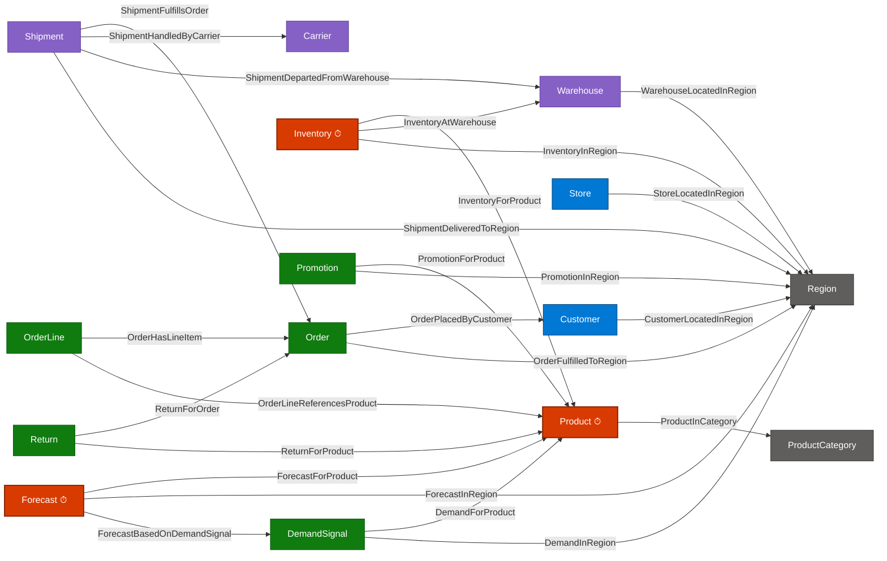

# Fabric IQ Lab — Blow‑Away Talking Points

> Demo asset: this repo provisions a **15‑entity / 24‑relationship retail + supply‑chain ontology** on top of OneLake (Delta) + Eventhouse (KQL), using two notebooks and a single portable `.iq` package.

---

## 1. The 30‑Second Hook (open with this)

> *"Every retailer has the same problem: their data is technically correct and semantically useless. A column called `fcst_conf_pct` in a Delta table means nothing to a merchandiser, nothing to a Copilot, and nothing to an agent. Today I'm going to show you how Fabric IQ turns your lakehouse into a **business‑aware knowledge graph** — so the same data instantly speaks the language of your business, your AI, and your decisions. And I'm going to do it in **two notebooks and under five minutes**."*

---

## 2. The Problem You're Solving (frame the pain in their language)

- BI teams ship dashboards; **AI agents and Copilots still can't answer "what's my at‑risk inventory in cold‑chain regions?"** because they don't know what an entity, a relationship, or a metric *means*.
- Every analyst rediscovers the same joins. Every LLM hallucinates them.
- Semantic models are great for **reports**; they don't ground **agents, real‑time signals, or cross‑workload reasoning**.
- A knowledge graph on top of the lakehouse is what's missing — and historically it cost a 6‑month project and a Neo4j cluster.

---

## 3. What Fabric IQ Is — in one sentence

**Fabric IQ is the semantic / ontology layer of OneLake** — a unified knowledge graph that maps your *business concepts* (Customer, Order, Shipment, Forecast) to your *physical data* (Delta tables + Eventhouse KQL streams) — once — and is then consumed by Copilot, Foundry agents, Power BI, Real‑Time Intelligence, and your own apps.

It is part of the **Fabric IQ workload (preview)**, which groups together: Ontology, Power BI Semantic Model, Graph, Plan, Data Agent, and Operations Agent — all sharing one business vocabulary.

---

## 4. Standards Alignment — RDF, OWL, RDFS (and how to talk about it)

Expect a sharp customer to ask: *"Is this RDF/OWL? Can I run SPARQL? Is this a 'real' ontology?"* Here's the honest, defensible answer.

### The metamodel is W3C‑aligned by design

Fabric IQ uses the same first‑class primitives that the semantic‑web stack has used for 25 years:

| Semantic Web (W3C) | Fabric IQ Ontology | What it means |
|---|---|---|
| `owl:Class` / `rdfs:Class` | **Entity Type** (e.g. `Customer`, `Product`) | Reusable concept definition |
| `owl:NamedIndividual` | **Entity Instance** | Concrete row materialized from a binding |
| `owl:DatatypeProperty` | **Property** with `PropertyDataType` (`String`, `Double`, `BigInt`, `DateTime`, `Boolean`) | A typed fact about an entity |
| `owl:ObjectProperty` | **Relationship** with `Source/TargetEntityTypeName` | A typed directional link between entities |
| `rdfs:domain` / `rdfs:range` | `SourceEntityTypeName` / `TargetEntityTypeName` | Type constraints on relationships |
| `owl:hasKey` / IFP | `IsIdentifier = TRUE` on a property | Identifier semantics for entity resolution |
| Annotation properties | `IsDisplayName`, `IsTimeseries` | Rendering & temporal hints |
| Cardinality restrictions | Relationship cardinality rules | "One Customer has many Orders" |
| Ontology imports / shared vocab | The portable **`.iq` package** | Versionable, distributable schema unit |

> **Talking point:** *"If you've ever modeled in OWL, you'll feel at home in 10 minutes — entity types are classes, properties are datatype properties, relationships are object properties, identifiers are inverse functional, and the ontology package is your shareable vocabulary."*

### Where it goes **beyond** classical RDF/OWL

These are the parts that make a customer who *knows* RDF/OWL lean forward:

1. **Live data bindings.** A classical OWL ontology terminates at the T‑Box; instances usually need a separate triple store. Fabric IQ binds entity properties **directly to physical Delta tables and KQL columns in OneLake** — the A‑Box is your existing lakehouse. **Zero data movement, zero second copy.**
2. **Dual‑engine instance data.** One ontology spans **batch (Delta) + streaming (Eventhouse/KQL)** — `IsTimeseries = TRUE` properties resolve against time‑series tables natively. Classical RDF stores don't do that.
3. **Governance inheritance.** Workspace RBAC, Purview lineage, and sensitivity labels apply automatically — you don't have to bolt on a separate triple‑store security model.
4. **AI‑grounding native.** The ontology is the contract that Copilot, Foundry agents, and Operations Agents reason against. You're not exporting RDF to feed a separate LLM pipeline.

### Where it intentionally **diverges**

Be honest — don't oversell:

- **No SPARQL endpoint.** Fabric IQ pairs with the **Graph (preview)** item, which uses **GraphQL (GQL)** for traversal and `T‑SQL`/`KQL` for tabular queries.
- **No OWL reasoner** (no `rdfs:subClassOf` inheritance chain, no DL reasoning, no SWRL). Fabric IQ favors **operational rules** (e.g. *"if inventory < threshold trigger replenishment"*) executed by Operations Agents and Activator — pragmatic over academic.
- **Not pure triples.** The on‑disk representation is Delta + KQL, not N‑Triples / Turtle. You get lakehouse performance and economics instead of triple‑store overhead.

### The Microsoft semantic‑standards landscape (positioning slide)

If a customer asks *"where does RDF/OWL live in your stack?"* — answer:

- **Azure Digital Twins** uses **DTDL** and has a [documented conversion path from OWL/RDF/RDFS](https://learn.microsoft.com/azure/digital-twins/concepts-ontologies-convert) for IoT / building / industry ontologies.
- **Fabric IQ Ontology** is the **enterprise‑data** counterpart — same conceptual lineage, optimized for analytics + agents on OneLake.
- Together they cover **operational telemetry (DTDL)** and **enterprise business semantics (Fabric IQ)** with a consistent mental model.

> **Closer for this section:** *"You don't have to abandon your investment in RDF/OWL thinking — Fabric IQ is the same shape, mapped to the lakehouse, made consumable by AI."*

---

## 5. What's Actually in This Demo (the numbers that wow)

| Item | Count |
|---|---|
| Business entities modeled | **15** — Customer, Product, ProductCategory, Region, Order, OrderLine, Carrier, Warehouse, Inventory, Shipment, DemandSignal, Forecast, Store, Promotion, Return |
| Relationships in the graph | **24** — a fully connected retail + supply‑chain mesh |
| Storage engines unified | **2** — Lakehouse Delta (master data) + Eventhouse / KQL (time‑series) |
| Time‑series entities | **3** — Product (price/discount), Inventory (on‑hand/available/backorder), Forecast (units/amount/confidence) |
| Sample dataset shipped | **~2.3 MB across 16 CSVs**, end‑to‑end realistic |
| Lines of code to stand it up | **~25** (one `generate_definition_from_package` + one `create_ontology_item` call) |
| Portable artifact | A single **`.iq` package** — versionable, shareable, CI/CD‑deployable |

---

## 6. Demo Flow & Per‑Step Talking Points

### Step 0 — Show the `.iq` package (the "trojan horse")

> *"This `retail_ontology_package.iq` is **the entire retail business model in a single 580 KB artifact** — entity definitions, relationships, bindings, AND seed data. I can email it, check it into Git, and promote it across dev/test/prod. Try doing that with a traditional MDM."*

### Step 1 — Run [Generate Ontology Data.ipynb](Notebook/Generate%20Ontology%20Data.ipynb)

> *"One cell creates **Delta tables in my lakehouse** for slow‑moving master data — customers, products, warehouses. The next cell pushes **time‑series events into Eventhouse** — inventory levels, price changes, forecast updates. Notice: same package, two engines, one command each. **Fabric IQ doesn't care where your data lives.**"*

Hit these points:
- `generate_instance_data` → Delta (Bronze/Silver pattern, write‑optimized)
- `generate_events_data` → KQL (sub‑second query on streaming events)
- This is the **dual‑engine truth** that legacy ontology tools can't touch

### Step 2 — Run [Create Ontology from Package.ipynb](Notebook/Create%20Ontology%20from%20Package.ipynb) (the headline moment)

> *"In a single call, I'm now going to translate physical columns into business language. Look at this — the source column is `sfty_stock_qty`. The ontology exposes it as `SafetyStockQty` on the `Inventory` entity. `is_cold_chain_requ` becomes `IsColdChainRequired` on `Region`. **The lakehouse never changes. The meaning is layered on top.**"*

Then click into the ontology in the Fabric portal and call out:
- **15 entities + 24 relationships** materialized as a navigable graph
- **Identifier columns, display names, time‑series flags** all preserved
- Bindings prove provenance — every business property points back to its physical column, table, workspace, and item

### Step 3 — Show the cross‑engine relationships (the "wow")

Trace this live in the graph:

`Customer` → `Order` → `OrderLine` → `Product` → `Inventory (time‑series, KQL)` → `Warehouse` → `Region` → `Shipment` → `Carrier`

> *"That path I just traced crossed **two storage engines, eleven tables, and zero joins I had to write**. An agent grounded on this ontology now answers 'Which customers ordered cold‑chain products from warehouses with under‑safety‑stock inventory in the last 24 hours?' — natively."*

### Step 4 — Tie it to what they care about

Pick one or two scenarios from the model and narrate the business outcome:

- **`Forecast → DemandSignal → Product → Region`** → *"Forecast accuracy by channel, by region, by SKU — for the agent, this is one question."*
- **`Return → Order → Product → ProductCategory`** → *"Return‑rate root‑cause analysis across departments — without a single hand‑written join."*
- **`Promotion → Product → Inventory`** → *"'Will my promo blow out my inventory?' — answered on live KQL data through the same ontology."*
- **`Shipment → Carrier (HasColdChainCapability) → Region (IsColdChainRequired)`** → *"Compliance and risk reasoning baked into the model."*

---

## 7. The Retail Ontology Graph

**Legend:** ⏱ = time‑series entity bound to Eventhouse/KQL. All other entities bind to Lakehouse Delta tables.

---

## 8. The Differentiator Slide (memorize these 5)

1. **Native to OneLake.** Not a bolt‑on graph database. No extra cluster, no ETL out, no second copy of your data.
2. **Dual‑engine in one model.** Delta + KQL unified — master data *and* real‑time time‑series are first‑class citizens.
3. **Standards‑aligned, lakehouse‑optimized.** RDF/OWL‑shaped metamodel (classes, properties, object properties, identifiers) without the triple‑store tax.
4. **Code‑first AND portable.** Authored from a notebook, packaged as a `.iq` file, promoted through CI/CD — not click‑ops.
5. **Grounding layer for AI.** Copilot, Foundry agents, and Operations Agents reason against the ontology, not against raw columns → **dramatically lower hallucination, higher answer accuracy**.

---

## 9. Anticipated Questions & Killer Answers

| They ask… | You answer… |
|---|---|
| *"How is this different from a Power BI semantic model?"* | "Semantic models are scoped to a report. The Fabric IQ ontology is **tenant‑wide, cross‑workload, and consumable by agents and apps** — and it covers streaming data, which semantic models don't. In fact, you can **generate an ontology from an existing semantic model** so you don't start from zero." |
| *"Is this RDF / OWL? Can I run SPARQL?"* | "The metamodel is RDF/OWL‑shaped — classes, properties, object properties, identifiers, cardinality. It's not a SPARQL endpoint by design; traversal uses GraphQL via the Graph item, and tabular access uses T‑SQL/KQL — so you get **lakehouse performance instead of triple‑store overhead**." |
| *"Do I have to move my data?"* | "No. Bindings point to your existing Delta tables and KQL databases in place. **Zero data movement.**" |
| *"What about governance / Purview?"* | "The ontology is a Fabric item — it inherits workspace RBAC, sensitivity labels, and shows up in lineage end‑to‑end." |
| *"How does an agent actually use this?"* | "Foundry data and operations agents are grounded on the ontology — they discover entity types, traverse relationships, and generate grounded DAX/KQL/GraphQL. Happy to show that next." |
| *"Can I evolve the model?"* | "Yes — change the CSVs in the `.iq` package, re‑run the notebook, redeploy. **Schema evolution is a Git PR.**" |
| *"What about DTDL / Digital Twins?"* | "DTDL is the right tool for **operational telemetry** — buildings, devices, IoT. Fabric IQ is its **enterprise‑data counterpart** for analytics + agents on OneLake. Same conceptual lineage, different optimization target." |

---

## 10. Compete: Palantir Foundry Ontology — How to Win the Bake‑off

> Palantir is the *category‑defining* product for enterprise ontology. Credit it openly, then pivot to where Fabric IQ wins.

### Side‑by‑side at a glance

| Dimension | **Microsoft Fabric IQ Ontology** | **Palantir Foundry Ontology** |
|---|---|---|
| **Storage format** | Open — **Delta Lake (Parquet)** in OneLake + KQL in Eventhouse | Proprietary internal datasets; export requires Foundry tooling |
| **Open‑standards alignment** | Maps cleanly to **W3C OWL / RDFS** (Class, DatatypeProperty, ObjectProperty, IFP/hasKey). Queryable as graph via **GraphQL** *and* tables via **T‑SQL / KQL** | Object‑Type / Link‑Type model is Palantir‑proprietary. No native OWL/RDF/SPARQL surface |
| **Compute engines on the same data** | **All Fabric engines** read the same OneLake copy: Spark, Warehouse (T‑SQL), Eventhouse (KQL), Power BI Direct Lake, Copilot, Data Agents, Real‑Time Dashboards | Foundry's own engines (Contour, Workshop, Code Workbooks, Pipeline Builder, AIP). Outside‑Foundry access is gated through Foundry APIs |
| **Time‑series / streaming** | Native: bind entities to **KustoTable** and stream via **Eventstream / Real‑Time Hub** with Activator alerts | Available via Foundry streaming, but historically a weaker story than the batch object world |
| **AI / Copilot grounding** | **Copilot, Data Agents, FabricIQ MCP** ground directly on the ontology. Customer can also point Azure OpenAI / Foundry Agents at the same OneLake | AIP Logic / AIP Agents are Palantir‑only and tied to the Foundry ontology |
| **BI integration** | **Power BI Direct Lake** reads ontology tables with zero copy — no semantic re‑modeling | Reports via Foundry Workshop or exports to PBI/Tableau (extra hop) |
| **Pricing model** | Pay‑as‑you‑go **Fabric capacity (CU)** — one SKU covers ontology, lakehouse, warehouse, RTI, BI | Per‑seat + platform fee, typically multi‑year enterprise contract |
| **Lock‑in** | Walk away with your **Delta tables in OneLake** — already an open standard | Significant — proprietary datasets, pipelines, workshop apps, ontology metadata |
| **Time to value** | Hours: install accelerator wheel → run notebook → ontology + sample data | Weeks–months: requires FDEs or partner onboarding, dataset registration, pipeline build |
| **Developer surface** | **GraphQL, T‑SQL, KQL, REST, Python SDK, MCP** — all open and documented | Foundry SDK, OSDK, Workshop — capable but proprietary |
| **Maturity** | **Preview** in 2026 — newer, evolving feature set | **GA, 10+ years** — battle‑tested in defense, intel, pharma, manufacturing |
| **Identity & governance** | **Microsoft Entra ID**, OneLake RBAC, Purview lineage & sensitivity labels — same controls as the rest of M365/Azure | Foundry's own RBAC + Markings; integrates with Entra but is a separate plane |

### The four sharp soundbites (memorize these)

1. **"Open by construction, not by export."** Fabric IQ stores the ontology's instance data as **Delta Parquet in OneLake**. If a customer ever leaves Fabric, they keep their data — it's already in an open standard. Palantir requires an export project.
2. **"One copy, every engine."** In Fabric, the *same row of the same table* can be read by Power BI Direct Lake, T‑SQL Warehouse, KQL Eventhouse, Spark notebooks, Copilot, and Data Agents — concurrently, with zero ETL. Foundry mediates access through its own runtime.
3. **"Standards‑aligned, AI‑ready."** The ontology cleanly maps to **W3C OWL / RDFS** and exposes a **GraphQL endpoint** plus **MCP** for agents. Customers don't have to learn a vendor‑specific object model.
4. **"M365 & Azure native — not a separate platform."** Fabric IQ inherits **Entra ID, Purview, Defender, Fabric Capacity, Copilot Studio, Foundry Agents**. Palantir is an excellent island; Fabric is the mainland.

### Be honest where Palantir wins (so you stay credible)

- **Maturity & references** — defense, intel, life‑sciences, manufacturing case studies are deep.
- **Workshop / AIP application builder** — a polished, opinionated low‑code app‑on‑ontology surface; Fabric's Data Apps + Copilot Studio are catching up but newer.
- **FDE‑led delivery model** — Palantir's forward‑deployed engineers ship outcomes fast; Fabric typically relies on partner SI capacity.
- **Action / write‑back / "decisions"** — Foundry's "Actions" framework is end‑to‑end (read → reason → act on systems of record). Fabric composes this with **Activator + Power Automate / Foundry Agents** — equally capable, but assembled rather than out‑of‑the‑box.

### Closing positioning lines for the room

> *"Palantir gives you an ontology **inside their platform**. Fabric IQ gives you an ontology **on your data**, in open formats, callable by every engine and every AI agent your enterprise will ever buy — including Palantir, if you keep it."*

> *"With Palantir you license a platform. With Fabric IQ you keep your Parquet."*

> *"If a customer is already in M365 and Azure, the question isn't 'is Palantir better?' — it's 'is Palantir 5–10× better, because that's the TCO delta?'"*

---

## 11. The Closer

> *"What you just saw is the **end of 'data is the new oil' and the start of 'data is the new language'**. With Fabric IQ, your lakehouse stops being a pile of tables and becomes a **business model your AI can read fluently** — in two notebooks, with one portable package, against the data you already have in OneLake today."*
