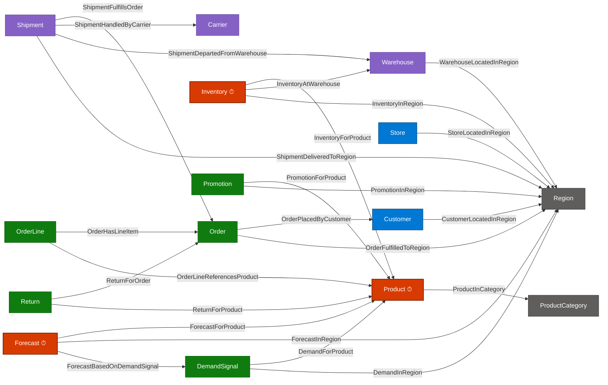

# Fabric IQ Demo — Retail & Supply‑Chain Ontology

> Stand up a **15‑entity / 24‑relationship** retail + supply‑chain knowledge graph on **Microsoft Fabric IQ (preview)** in under five minutes, using two notebooks and a single portable `.iq` package. Backed by **OneLake (Delta)** for master data and **Eventhouse (KQL)** for time‑series — one ontology, two engines, zero data movement.

📑 **Presenter / SE narrative & RDF–OWL standards positioning →** [TALKING_POINTS.md](TALKING_POINTS.md)

🧪 **Hands-on lab execution guide →** [LAB_STEP_BY_STEP_GUIDE.md](LAB_STEP_BY_STEP_GUIDE.md)

---

## Why this demo

Every organization has the same gap: their data is technically correct and *semantically useless*. A column called `fcst_conf_pct` means nothing to a merchandiser, nothing to Copilot, and nothing to an agent.

**Fabric IQ** turns the lakehouse into a **business‑aware knowledge graph** so the same data instantly speaks the language of your business, your AI, and your decisions.

This demo proves it on a realistic retail + supply‑chain model that customers immediately recognize.

---

## What you get

| | |
|---|---|
| 🧠 Business entities | **15** — Customer, Product, ProductCategory, Region, Order, OrderLine, Carrier, Warehouse, Inventory, Shipment, DemandSignal, Forecast, Store, Promotion, Return |
| 🔗 Relationships | **24** — a fully connected retail + supply‑chain mesh |
| 🗄️ Storage engines unified | **Lakehouse Delta** (master data) + **Eventhouse / KQL** (time‑series) |
| ⏱️ Time‑series entities | **3** — Product (price/discount), Inventory (on‑hand/avail/backorder), Forecast (units/amount/confidence) |
| 📦 Portable artifact | A single `.iq` package — versionable, shareable, CI/CD‑deployable |
| ⌨️ Lines of code | **~25** end‑to‑end |

---

## The retail ontology graph



**Legend:** ⏱ = time‑series entity bound to Eventhouse/KQL · others bind to Lakehouse Delta.

---

## Prerequisites

Before you start, make sure you have:

- [ ] A **Microsoft Fabric** tenant with capacity assigned (F‑SKU or trial)
- [ ] **Fabric IQ (preview)** enabled in the tenant admin portal
- [ ] Permission to create the following items in a workspace:
  - **Lakehouse** (schema‑enabled recommended)
  - **Eventhouse** (with a KQL Database inside)
  - **Notebook**
  - **Ontology (preview)** item — part of the Fabric IQ workload
- [ ] The two ontology artifacts staged into your Lakehouse `Files/` area (see **Step 1** below):
  - `fabriciq_ontology_accelerator-0.1.0-py3-none-any.whl`
  - `retail_ontology_package.iq`

> 📦 **Artifact location in this repo:**  
> `Ontology/fabriciq_ontology_accelerator-0.1.0-py3-none-any.whl`  
> `Ontology/retail_ontology_package.iq`

---

## What's in this folder

```
09-fabric-iq-retail-ontology/
├── README.md                              ← you are here
├── TALKING_POINTS.md                      ← presenter narrative + RDF/OWL positioning
├── Fabric IQ Lab.docx                     ← original lab handout (Word)
├── Notebook/
│   ├── Generate Ontology Data.ipynb       ← Step 2 — materialize Delta + KQL data
│   └── Create Ontology from Package.ipynb ← Step 3 — bind ontology to the data
└── Ontology/
    ├── fabriciq_ontology_accelerator-0.1.0-py3-none-any.whl
    ├── retail_ontology_package.iq
    └── README.md                          ← artifact details and staging path
```

---

## Prepare local lab assets

Before running the lab, download or clone this GitHub repo to your local machine, then copy the lab assets to `C:\Lab Assets\`.

- `Ontology/` — contains the `.whl` accelerator and `.iq` ontology package.
- `Notebook/` — contains the Fabric notebooks to import into your workspace.

## Talking points

For the full presenter narrative — including the **RDF / OWL / RDFS standards alignment** mapping table, the *"where it goes beyond classical RDF/OWL"* section, anticipated Q&A, and the closer — see:

➡️ **[TALKING_POINTS.md](TALKING_POINTS.md)**

---

## Troubleshooting

| Symptom | Fix |
|---|---|
| `%pip install` of the .whl fails | Confirm the `.whl` is at `/lakehouse/default/Files/` and the notebook is attached to the right default lakehouse. |
| `KeyError` / empty `items_df` row for the Lakehouse or Eventhouse | The `Display Name` in the notebook must match the item name in the workspace exactly (case‑sensitive). |
| `403` calling the create‑ontology API | Your identity needs **Member or higher** on the workspace **and** the Fabric IQ workload must be enabled in the tenant. |
| Eventhouse cell fails to authenticate | The `eventhouse_cluster_uri` must be the **Query URI** (ends in `.kusto.fabric.microsoft.com`), and your identity needs **Database User** on the KQL Database. |
| No schemas on lakehouse | Set `binding_lakehouse_schema_name = None` and `lakehouse_schema = None`. |

---

## References

- [What is Fabric IQ?](https://learn.microsoft.com/fabric/iq/overview)
- [What is ontology (preview)?](https://learn.microsoft.com/fabric/iq/ontology/overview)
- [How to bind ontology data](https://learn.microsoft.com/fabric/iq/ontology/how-to-bind-data)
- [Graph in Microsoft Fabric (preview)](https://learn.microsoft.com/fabric/graph/overview)
- [Operations Agent](https://learn.microsoft.com/fabric/real-time-intelligence/operations-agent)

---

*Demo authored from `c:\Data\CSA\Fabric\FabricIQ Lab` and published as part of [`fabric-faraza-development`](https://github.com/fazalraza1/fabric-faraza-development).*
